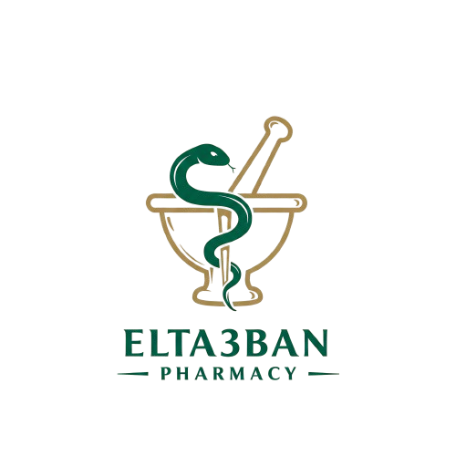

# EL-TA3BAN Pharmacy Management System Documentation

<p align="center">
  
</p>

*Generated on: 2025-03-26*

## Table of Contents

1. [System Overview](#system-overview)
2. [Classes](#classes)
3. [Services](#services)
4. [Doctor-Patient Chat System](#doctor-patient-chat-system)
5. [Data Flow](#data-flow)
6. [System Statistics](#system-statistics)
7. [Object-Oriented Programming Concepts](#object-oriented-programming-concepts)

## System Overview

The EL-TA3BAN Pharmacy Management System is a comprehensive application that manages pharmacy operations including inventory, patient accounts, prescriptions, and orders. It follows object-oriented design principles and provides functionality for different user roles including administrators, patients, doctors, and pharmacists.

The system features a complete healthcare workflow between doctors, pharmacists, and patients with secure local wallet payment processing, prescription management, inventory tracking, and a comprehensive doctor-patient consultation system with real-time messaging.

## Classes

### User Class Hierarchy

| Class | Description |
|-------|-------------|
| `User` | Abstract base class for all users |
| `Admin` | System administrator with elevated privileges |
| `Patient` | Represents patients in the healthcare system |
| `Doctor` | Medical professionals who create prescriptions |
| `Pharmacist` | Pharmacy staff who process prescriptions |

### Healthcare Entities

| Class | Description |
|-------|-------------|
| `Medicine` | Pharmaceutical products available in the system |
| `Prescription` | Medical orders created by doctors for patients |
| `Order` | Patient requests for medicines |
| `MedicalReport` | Patient health information and diagnosis |
| `Pharmacy` | Represents physical pharmacy location |
| `Consultation` | Doctor-patient interaction record |
| `Message` | Communication between doctors and patients |
| `Wallet` | Patient digital wallet for payments |
| `Transaction` | Financial transaction record |

## Services

| Service | Description |
|---------|-------------|
| `AdminService` | Handles admin operations and system management |
| `PatientService` | Manages patient functionality including orders and consultations |
| `DoctorService` | Manages doctor operations, prescriptions, and medical reports |
| `PharmacistService` | Handles prescription processing and inventory management |
| `PharmacyService` | Core service integrating all functionality |
| `AuthenticationService` | Handles user authentication and security |

## Doctor-Patient Chat System

The pharmacy management system includes a complete doctor-patient consultation and chat functionality:

### Consultation Features

- **Creation**: Doctors can create and manage patient consultations
- **Messaging**: Real-time messaging between doctors and patients
- **History**: Complete message history with timestamps
- **Prescription Generation**: Doctors can generate prescriptions directly from consultations

### Message Structure

Each message in the system contains:

- Unique ID
- Sender ID (doctor or patient)
- Receiver ID (doctor or patient)
- Message content
- Timestamp

### Consultation Workflow

1. Doctor creates a consultation for a patient
2. Both parties can exchange messages
3. Doctor can create prescriptions based on the consultation
4. Patient can view all consultations and messages in their account

## Data Flow

```
Doctor ─────────> Consultation <─────── Patient
  │        creates      │ participates    │
  │                     ▼                 │
  │                  Message              │
  │                     │                 │
  ▼                     ▼                 ▼
Prescription ───> Medicine Order ───> Wallet
  │                     │                 │
  ▼                     ▼                 ▼
Pharmacist ────> Pharmacy <──────────> Admin
```

## System Statistics

### Users and Entities

- **Total Users:** 10
  - Administrators: 3
  - Patients: 3
  - Doctors: 3
  - Pharmacists: 1
- **Medicines:** 11
- **Orders:** 0
- **Prescriptions:** 1
- **Consultations:** 1
- **Pharmacies:** 1

## Object-Oriented Programming Concepts

### Inheritance

The system implements inheritance through the User class hierarchy. The abstract User class serves as the parent class for Admin, Patient, Doctor, and Pharmacist subclasses. This allows for code reuse while enabling specific behaviors for each user role.

### Encapsulation

All classes use encapsulation with private fields and public getters/setters to control access to data. This protects the internal state of objects and ensures data integrity.

### Polymorphism

Polymorphism is demonstrated through method overriding in user subclasses and through the different implementations of common methods across services.

### Abstraction

The system uses abstraction through service classes that hide the complex implementation details from the user interface. Each service provides a clean API for interacting with the underlying data.

### Class Relationships

| Relationship | Type | Description |
|-------------|------|-------------|
| User → Admin/Patient/Doctor/Pharmacist | Inheritance | Parent-child relationship |
| Consultation → Message | Composition | Messages belong to a consultation |
| Doctor → Prescription | Association | Doctors create prescriptions |
| Patient → Order | Association | Patients create orders |
| Pharmacy → Pharmacist | Aggregation | Pharmacists work at pharmacies |
| Patient → Wallet | Composition | Wallets belong to patients |

