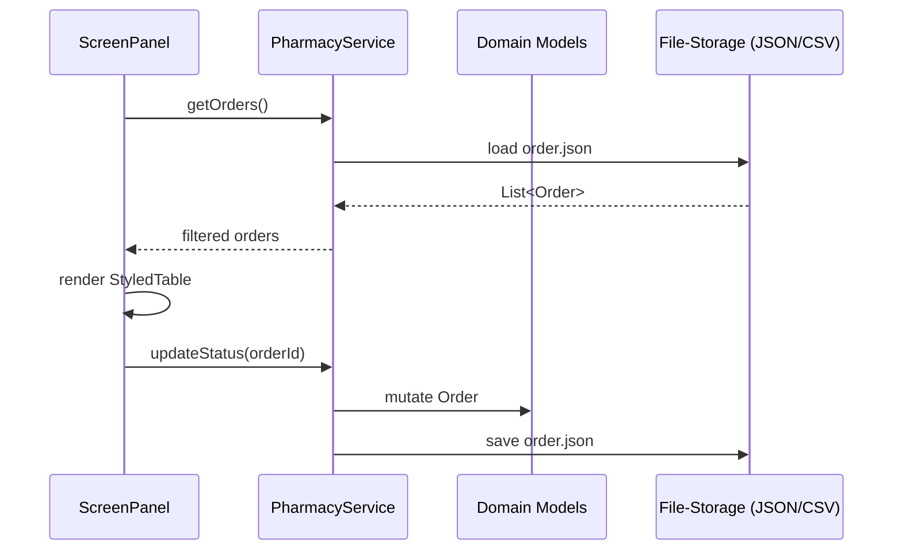

# GUI & System Overview

This document explains **how the GUI is built**, what **functionality each user role** can perform, whether that functionality is *implemented*, how **data flows** through the layers, and the **purpose of every top-level folder**.  It complements the deep-dive docs and JavaDoc site.

---
## 1  GUI Construction Philosophy

| Layer | Purpose | Key Classes |
|-------|---------|-------------|
| **Theming** | Centralise colours, fonts, iconography so the rest of the UI is brand-agnostic | `ThemeManager`, `ThemeColors`, `ThemeFonts`, `ThemeIcons`, `ThemeSizes` |
| **Reusable Widgets** | Wrap Swing components to enforce look-and-feel & behaviour | `StyledButton`, `StyledTable`, `StyledTextField`, `ModernDialog`, `ActionButton`, `BasePanel` |
| **Navigation Shell** | Presents side/top bars & swaps screens via `CardLayout` | `MainFrame.navigateTo()`, dashboards & management panels |
| **Domain Screens** | High-level panels bound to services/models | `AdminDashboardPanel`, `MedicineManagementPanel`, `OrderManagementPanel`, etc. |
| **Service Layer** | Business logic & persistence orchestration | `PharmacyService`, `DoctorService`, etc. |
| **Model Layer** | POJOs representing domain entities | `User`, `Order`, `Medicine`, … |

Design patterns employed: **Singleton** (ThemeManager), **Factory** (ThemeIcons), **Observer** (`PropertyChangeSupport` in models), **MVC/MVP hybrid** (screen panels delegate to services), **Template Method** (BasePanel, BaseDashboard).

---
## 2  User Roles & Functional Matrix

| Role | GUI Feature | Screen / Panel | Implemented | Notes |
|------|-------------|----------------|-------------|-------|
| **Admin** | Dashboard KPIs | `AdminDashboardPanel` | ✅ | Cards, charts, recent activity |
|          | User Management (CRUD) | `UserManagementPanel` | ✅ | Search, filter, add, edit, delete |
|          | Medicine Catalogue | `MedicineManagementPanel` | ✅ | CSV import/export, stock alert badges |
|          | Orders Overview | `OrderManagementPanel` | ✅ | Status filter, view/process |
|          | Reports / Analytics | `ReportsPanel` | ✅ | Generates CSV/PDF, charts |
| **Doctor** | Dashboard | `DoctorDashboard` | ✅ | Patient stats |
|           | Patient List | `PatientListPanel` | ✅ | Table with search |
|           | Prescriptions | `PrescriptionsPanel` | ✅ | Create & sign prescriptions |
|           | Consultations | `ConsultationsPanel` | ✅ | Appointment list (basic) |
|           | Medical Records | `MedicalRecordsPanel` | ⚠️ *Partial* | View-only, edit planned |
| **Pharmacist** | Dashboard | `PharmacistDashboardPanel` | ✅ | Incoming orders & Rx KPIs |
|                | Medicine Inventory | `MedicineManagementPanel` (shared) | ✅ | Restricted actions |
|                | Order Queue | `OrderManagementPanel` | ✅ | Process / validate |
|                | Prescription Validation | `PrescriptionManagementPanel` | ✅ | Approve / reject |
| **Patient** | Dashboard | `PatientDashboardPanel` | ✅ | Activity summary |
|             | Browse Medicines | `MedicineManagementPanel` (read-only) | ✅ | Add to cart planned |
|             | View Orders | `OrderManagementPanel` (filtered) | ⚠️ Partial | Status tracking only |
|             | Prescriptions | (future) | ⬜ Planned | Will display doctor prescriptions |

Legend: ✅ Implemented ⚠️ Partially Implemented ⬜ Planned

---
## 3  Data Processing & Workflow

1. **UI Layer (Swing Panel)** requests data via a service façade.
2. **Service Layer** loads domain objects from JSON (or caches) and enforces business rules.
3. **Model Layer** changes state; `PropertyChangeSupport` notifies listeners if bound to UI.
4. Service persists the change back to flat-file storage (JSON/CSV).  A database adapter can be swapped in later.

---
## 4  Folder Rationale

| Folder | Why it exists / What goes inside |
|--------|----------------------------------|
| `src/gui/theme` | Consolidates theme artefacts so we *don't* sprinkle colour/size magic-numbers across widgets.  Enables brand re-skin by editing a handful of classes. |
| `src/gui/components` | Home for **all** reusable widgets.  No screen-specific logic allowed here.  Guarantees consistent styling (e.g., `StyledButton`) across dashboards. |
| `src/gui/screens` | Generic screens (login, registration) that don't belong to a specific role. |
| `src/gui/admin`, `doctor`, `pharmacist`, `dashboard` | Role-scoped or domain-scoped panels, keeping features discoverable.  Each extends `BasePanel` so spacing & colours are uniform. |
| `src/gui/navigation` | (Obsolete) previously held `SidebarPanel`; we now route via top-bar buttons. |
| `src/models` | Pure data objects—no Swing or persistence code.  Serializable to JSON/XML. |
| `src/services` | Business logic + DAO responsibilities.  Shields the GUI from file format / DB changes. |
| `src/data` | Seed JSON / CSV samples for demo purposes. |
| `icons` | All PNG/SVG assets addressed by `ThemeIcons`. |
| `docs` | Markdown & diagrams—kept versioned with code. |

---
## 5  Consistency Across Dashboards & Screens

* **Inheritance** – All dashboards extend `BaseDashboardPanel`, which defines:
  * unified header band (title + icon)
  * reusable `DashboardStat` & `DashboardActivity` inner classes for KPI cards & activity feeds
  * common padding & surface colour.
* **Theming** – Buttons, tables, dialogs consult `ThemeColors` and `ThemeFonts`, so a palette swap propagates everywhere.
* **Layout Primitives** – `LayoutUtils`, `Flex` helpers abstract `Box` / `GridBag` boilerplate, ensuring spacing harmony.
* **Navigation** – `MainFrame.navigateTo(route)` is the single entry point; no panel constructs another panel directly, which prevents divergent flows.

---
## 6  How to Verify Implementation Coverage

Run the application and log in with each demo user account (provided in `data/users.json`).  Use the matrix in Section 2 to tick off implemented features; partial screens will show a banner *"Coming Soon"* message coded in their `initializeComponents()`.

Automated test stubs exist in `test/integration/` to crawl the GUI (via AssertJ-Swing) and assert that every route renders without exception—helpful CI safety-net.

---
*Last updated: {{DATE_AUTOGEN}}* 